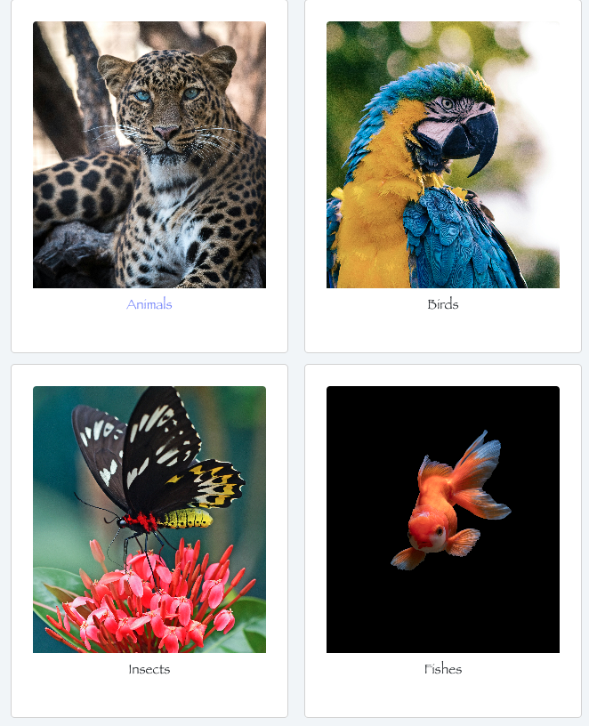

# Zoo Application

A short description of this project. 
What it is about, who are target group and why that project was made. 

This application was developed to display animal categories using the React framework, in order to apply the concept of fetching data from a local directory and through external APIs. This is part of the learning curve for students to grasp the major concept of rendering information on the browser using React, for both internal and external consumption.

## Technologies used

Built with: 

- HTML
- JS
- CSS
- Bootstrap
- Reactjs 
- Google icons

## Setup and usage

Live page: https://ekundayoso.netlify.app

## Screenshot
<!--  -->
<!--   -->

## Authors and acknowledgment

Sulaimon Ekundayo
- GitHub @ekundayoSo

